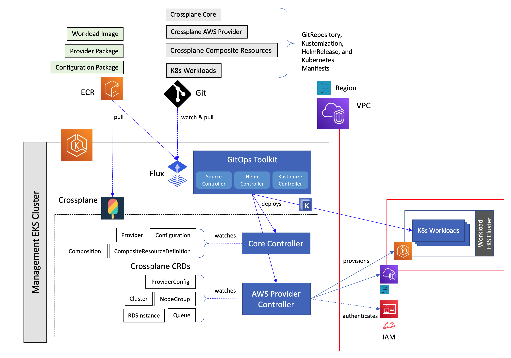

## Amazon EKS cluser management with Crossplane and Flux

This Git repository contains software artifacts to deploy [Crossplane](https://crossplane.io/) server and [Flux](https://fluxcd.io/) to an existing Amazon EKS cluster and then leverage the GitOps workflow to manage both provisioning a remote EKS cluster with Crossplane and subsequently manage application deployments to it using Flux. Please refer to the [accompanying blog post](https://aws.amazon.com/blogs/containers/gitops-model-for-provisioning-and-bootstrapping-amazon-eks-clusters-using-crossplane-and-flux) for details about how this works. Please also refer to the [earlier blog in this series](https://aws.amazon.com/blogs/containers/gitops-model-for-provisioning-and-bootstrapping-amazon-eks-clusters-using-crossplane-and-argo-cd/) for additional context.

### Solution overview

Here’s the high level overview of the solution architecture.

- Start off with an Amazon EKS cluster that was created using any one of the approaches outlined [here](https://docs.aws.amazon.com/eks/latest/userguide/create-cluster.html).
- Install and bootstrap Flux on this cluster to manage all deployment tasks, pointing to a Git repository containing the deployment artifacts. 
- Deploy Crossplane components needed to manage the lifecycle of AWS managed service resources.
- Deploy Crossplane composite resource to provision an Amazon EKS cluster
- Deploy a set of workloads to the new cluster

The goal is to manage all of these tasks in a declarative style based on the [GitOps](https://www.weave.works/blog/what-is-gitops-really) approach.

### Deployment overview

#### Imperative approach
The script [crossplane.sh](https://github.com/aws-samples/eks-gitops-crossplane-flux/blob/main/crossplane.sh) outlines the CLI commands to install Crossplane to a management EKS cluster and then provision a workload EKS cluster. The implementation uses Crossplane's [Composition](https://crossplane.io/docs/v1.4/concepts/composition.html) and [CompositeResourceDefinition](https://crossplane.io/docs/v1.4/concepts/composition.html) to create a Crossplane [Configuration package](https://crossplane.io/docs/v1.4/concepts/packages.html#configuration-packages) that will provision the complete infrastructure for setting up an EKS cluster - VPC, subnets, internet gateway, NAT gateways, route tables, and the EKS cluster with a managed node group. The figure below shows the relationship between various Crossplane custom resources used in this Configuration package and the set of AWS managed resources that they provision.

#### Declarative approach
The script [flux.sh](https://github.com/aws-samples/eks-gitops-crossplane-flux/blob/main/flux.sh) outlines the steps involved in installing and bootstrapping Flux on the management EKS cluster and then leveraging the GitOps workflow in Flux to manage both provisioning and management of a remote workload cluster.

## Security
See [CONTRIBUTING](CONTRIBUTING.md#security-issue-notifications) for more information.

## License
This library is licensed under the MIT-0 License. See the LICENSE file.